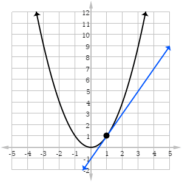

# Otimização

## Álgebra Linear: alguns conceitos.

Matriz é um arranjo retangular (duas dimensões),de números ou variáveis, em linhas e colunas.

$$ \boldsymbol{A} = \begin{bmatrix}10 & 12\\21 & 39\end{bmatrix}$$
$$ \boldsymbol{B} = \begin{bmatrix}1 & 1 & 1 & 1 & 1 & 1\\10 & 12 & 15 & 13 & 14 & 16\end{bmatrix}$$

Para representar os elements da matriz como variáveis, usamos o índice linha por coluna. Dessa maneira, $x_{ij}$ representa o elemento $x$ correspondente à $i$-ésima linha e $j$-ésima coluna:

$$ \boldsymbol{X} = (x_{ij}) =\begin{bmatrix}x_{11} & x_{12} & x_{13}\\x_{21} & x_{22} & x_{23}\\x_{31} & x_{32} & x_{33}\\x_{41} & x_{42} & x_{43}\end{bmatrix}$$

Usualmente, denotamos uma matriz genérica por $n$ linhas e $p$ colunas. A matriz acima, poussui $n = 4$ linhas e $p = 3$ colunas.

Um vetor é uma matriz com uma dimensão igual a 1. Geralmente, o termo vetor esa associado a um vetor coluna. Um vetor linha é representado como o transposto do vetor coluna.

$$y' = y^t =\begin{bmatrix}y_1 & y_2 & y_3\end{bmatrix}$$

### Igualdade de Matrizes
Duas matrizes (ou vetores) são equivalentes se possuem a mesma dimensão e todos os elementos são correspondentes.
$$\begin{bmatrix}3 & -2 & 4\\7 & 1 & 3\end{bmatrix} \neq \begin{bmatrix}3 & -2 & 4\\7 & -4 & 3\end{bmatrix}$$
$$\begin{bmatrix}3 & -2 & 4\\7 & 1 & 3\end{bmatrix} = \begin{bmatrix}3 & -2 & 4\\7 & 1 & 3\end{bmatrix}$$

### Matriz Transposta

 Uma matriz transposta é dada pela troca de posição entre linhas e colunas, ou seja, linhas se tornam colunas e colunas se tornam linhas. Denotamos por $\boldsymbol{A'}$ ou $\boldsymbol{A}^t$. Formalmente, se $\boldsymbol{A_{n \times p}} = a_{ij}$, sua transposta é dada por:

$$\boldsymbol{A'_{p \times n}} = A^t = (a_{ij})' = (a_{ji})$$

$$A = \begin{bmatrix}3 & -2 & 4\\ 7 & 1 & 3\end{bmatrix} \rightarrow A' = \begin{bmatrix}3 & 7\\ -2 & 1\\ 4 & 3\end{bmatrix}$$

```{r, eval=TRUE, comment=""}
mat2 <- matrix( c(3, -2, 4,
                  7, 1, 3),
                byrow = TRUE, ncol = 3)
mat2
dim(mat2)
```

### Matriz Simétrica

Se a matriz transposta é quivalente à matriz original, ou seja, $A' = A$, então dizemos que a matriz $A$ é uma matriz simétrica. Toda matriz simétrica é quadrada (número de linhas = número de colunas). Em uma matriz simétrica, $a_{ij} = a_{ji}$

$$A = \begin{bmatrix}3 & 8 & 4\\ 8 & 5 & 9\\ 4 & 9 & 7\end{bmatrix}$$ 

```{r, eval=TRUE, comment=""}
mat3 <- matrix( c(3, 8, 4,
                  8, 5, 9,
                  4, 9, 7), ncol = 3)

mat3[1, 2] == mat3[2, 1]
```

### Matriz Diagonal

Todos os elementos fora da diagonal de uma matriz são zero.
$$A = \begin{bmatrix}3 & 0 & 0\\ 0 & 5 & 0\\ 0 & 0 & 7\end{bmatrix}$$ 

Com a função `diag()` podemos criar uma matriz diagonal ou obter a diagonal de uma amtriz
```{r, eval = TRUE, comment=""}
diag(c(3, 5, 7))
diag(mat3)
```
### Operações com Matrizes

Adição de matrizes é feita somando seus elementos correspondentes.
$$\begin{bmatrix}7 & -3 & 4\\ 2 & 8 & 5\end{bmatrix} + \begin{bmatrix}11 & 5 & 1\\ 3 & -2 & 0\end{bmatrix} = \begin{bmatrix}18 & 2 & 5\\ 5 & 6 & 5\end{bmatrix}$$ 

```{r, eval = TRUE, comment=""}
mat4 <- matrix( c(7, -3, 4,
                  2, 8, 5), byrow = TRUE, ncol = 3)

mat5 <- matrix( c(11, 5, 1,
                  3, -2, 0), byrow = TRUE, ncol = 3)
mat4 + mat5
```

O produto  $\boldsymbol{AB}$ de duas matrizes só é possível se as matrizes possuem dimensões compatíveis. O número de coluna da matriz $\boldsymbol{A}$  deve ser o mesmo que o número de linhas da matriz $\boldsymbol{B}$. Dizemos então, que as matrizes $\boldsymbol{A}$ e $\boldsymbol{B}$ são conformes.  O elemento $AB_{11}$ da matriz resultado, é dado pela soma ponderada entre linha 1 e coluna 1. No exemplo, $AB_{11} = (2 \times 11) + (1 \times 3) + (3 \times 4) = 37$.

$$A = \begin{bmatrix}2 & 1 & 3\\ 4 & 6 & 5\end{bmatrix} \hskip1em \text{e} \hskip1em B = \begin{bmatrix}11 & 5\\ 3 & -2\\ 4 & 1\end{bmatrix}$$

No R, utilizamos o operador `%*%` para realizar multiplicações matriciais.

```{r, eval = TRUE, comment=""}
mat6 <- matrix( c(2, 1, 3, 4, 6, 5), byrow = TRUE, ncol = 3)
mat7 <- matrix( c(11, 5, 3, -2, 4, 1), byrow = TRUE, ncol = 2)
AB = mat6 %*% mat7
AB
```

A matriz identidade é o elemento neutro da multiplicação de matrizes.

$$AB = \begin{bmatrix}37 & 11\\ 82 & 13\end{bmatrix} \times \begin{bmatrix}1 & 0\\ 0 & 1\end{bmatrix} = \begin{bmatrix}37 & 11\\ 82 & 13\end{bmatrix}$$
```{r, eval = TRUE, comment=""}
AB %*% diag(2)
```

Note que uma multiplicação entre um vetor $v_{1\times n}$ e um vetor $e_{n\times 1}$ resulta em um escalar.
$$\begin{bmatrix}2 & 3 & 5 & 1\end{bmatrix} \times \begin{bmatrix}1\\ 2\\ 4 \\ 2\end{bmatrix} =30$$
```{r, eval = TRUE, comment=""}
t(c(2, 3, 5, 1)) %*% c(1, 2, 4, 2)
```

Desta maneira, a multiplicação de um vetor transposto, por ele mesmo, é sua soma quadrática.

$$a'a = \begin{bmatrix}2 & 3 & 5 & 1\end{bmatrix} \times \begin{bmatrix}2\\ 3\\ 5 \\ 1\end{bmatrix} = \sum_{i=1}^4 a_i^2$$
$$\sum_{i=1}^4 a_i^2 = 2^2 + 3^2 + 5^2 + 1^2 = 39$$

```{r, eval = TRUE, comment=""}
vetor <- c(2, 3, 5, 1)

t(vetor) %*% vetor
```

Da mesma forma, a multiplicação de um vetor pelo seu transposto, resulta em uma matriz quadrada e simétrica.

$$aa' = \begin{bmatrix}2\\ 3\\ 5\\ 1\end{bmatrix} \times \begin{bmatrix}2 & 3 & 5 & 1\end{bmatrix} = \begin{bmatrix}4 & 6 & 10 & 2\\6 & 9 & 15 & 3\\10 & 15 & 25 & 5\\2 & 3 & 5 & 1\end{bmatrix}$$

### Inversa de uma Matriz

O posto (rank) de uma matriz é definido como o número de colunas (linhas) linearmente independentes. Uma matriz quadrada de posto completo é não-singular. Isso significa que ela possui inversa única.
$$A = \begin{bmatrix}a & b\\ c & d\end{bmatrix} \hskip1em ; \hskip1em \rightarrow \hskip1em A^{-1} = \frac{1}{\text{det}} \begin{bmatrix}d & -b\\ -c  & a\end{bmatrix}$$
$$A = \begin{bmatrix}4 & 7\\ 2 & 6\end{bmatrix} \hskip1em ; \hskip1em \rightarrow \hskip1em A^{-1} = \frac{1}{ 24 - 14 } \begin{bmatrix}6 & -7\\ -2  & 4\end{bmatrix}$$

No R, calculamos a inversa de uma matriz através da função `solve()`
```{r, eval = TRUE, comment=""}
mat8 = matrix(c(4,7,2,6), byrow = T, ncol = 2)
solve(mat8)
```


## Estatística e Machine Learning

A abordagem estatística para análise e resumo de informações contidas em um conjunto de dados, consiste na suposição de que existe um mecanismo estocástico gerador do processo em análise [@bonat2012metodos]. Para isso, existem técnica que nos auxiliam na estimação de uma função (e.g. de regressão) que são de fundamental importância em estatística e machine learning.

Muitas ténicas de regressão usadas hoje são datadas de muitos anos atrás. Todavia, com o avanço computacional, métodos mais robustos em relação ao real processo gerador vêm ganhando cada vez mais espaço e importância[@izbicki2020aprendizado]. Por exemplo, em modelos com mais covariáveis que observações, métodos tradicionais sofrem pela falta de graus de liberdade.

De maneira geral, nosso objetivo é determinar uma relação entre uma variável aleatória de interesse $Y$ e um vetor de covariáveis $x = (x_1, ..., x_n)$. Então, temos que:

$$ g(x) := E [ Y | X = x]$$ 


#### Regressão Linear.

Apesar de simples, a regressão linear é um modelo de extrema importância. Um bom entendimento é resposável por fundamentos sólidos em conceitos de modelagem. Em um modelo de regressão linear, temos as seguintes definições:

\begin{align}
  y_i = \beta_0 + \beta_1 x_i + \epsilon_i (\#eq:um)
\end{align}

- $y_i$ é a variávei de dependente e $x_i$ é a variável explicativa.

- $\beta_0$ e $\beta_1$ são os parâmetros a serem estimados pelo modelo.

- $\epsilon_i$ é o erro associdao à i-ésima observação.

Vamos considerar um exemplo utilizando os dados 'mtcars', que consiste em informações sobre automóveis.
```{r, echo=FALSE}
data(mtcars)
knitr::kable(head(mtcars))
```
Quanto mais pesado o carro, menor a autonomia (quantidade de milhas percorridas por galão)?

$$Autonomia_i = \beta_0 + \beta_1 Peso_i + \epsilon_i$$

```{r plot-last2, echo=FALSE}
library(ggplot2)

mtcars$pred <- lm(mpg ~ wt, data = mtcars)$fitted.values

ggplot(data = mtcars, aes(x = wt, y = mpg)) +
  labs(x = "Peso", y = "Milhas p/ galão") +
  geom_segment(aes(xend = wt, yend = pred), alpha = .4, col = "firebrick") +  # alpha 
  geom_smooth(method="lm", se = FALSE) +
  geom_point(size = 2.5, col = "cyan4") +
  #geom_point(aes(y = pred), shape = 1) +
  ylim(c(8,34)) +
  theme_minimal()
```

#### Como achar a melhor reta?

Minimzando a soma dos erros quadráticos:
$$y_i = \beta_0 + \beta_1 x_i + \epsilon_i$$
$$\epsilon_i = y_i - \beta_0 - \beta_1 x_i$$
$$\epsilon_i^2 = (y_i - \beta_0 - \beta_1 x_i)^2$$
$$\sum_{i = 1}^{n} \epsilon_i^{2} = \sum_{i=1}^{n} (y_i - \beta_0 - \beta_1 x_i)^2$$

Temos então, nossa função de custo, que queremos minimzar:

\begin{align}
  \sum_{i = 1}^{n} \epsilon_i^{2} = \sum_{i=1}^{n} (y_i - \beta_0 - \beta_1 x_i)^2 (\#eq:dois)
\end{align}


Como minimizar uma função?
Derivando e igualando a zero. A derivada nos da a inclinação da reta tangente.


Devemos fazer as derivadas parciais da função de custo (L). Em relação a $\beta_0$ e em relação a $\beta_1$.

$$L = \sum_{i=1}^{n} (y_i - \beta_0 - \beta_1 x_i)^2$$
\begin{align}
\frac{\partial L}{\partial \beta_0} = -2 \sum_{i=1}^{n} (y_i - \beta_0 - \beta_1 x_i) (\#eq:tres)
\end{align}

\begin{align}
\frac{\partial L}{\partial \beta_1} = -2 \sum_{i=1}^{n} x_i(y_i - \beta_0 - \beta_1 x_i) (\#eq:cinco)
\end{align}


Igualando $\frac{\partial L}{\partial \beta_0} = 0$ e $\frac{\partial L}{\partial \beta_1} = 0$, obtemos as equações:

\begin{align}
  \sum_{i=1}^{n} (y_i - \hat{\beta}_0 - \hat{\beta}_1 x_i) = 0	\rightarrow n \hat{\beta}_0 + \hat{\beta}_1 \sum_{i=1}^{n} x_i = \sum_{i=1}^{n} y_i (\#eq:seis)
\end{align}

\begin{align}
  \sum_{i=1}^{n} x_i(y_i - \beta_0 - \beta_1 x_i) = 0	\rightarrow \hat{\beta}_0 \sum_{i=1}^{n} x_i + \hat{\beta}_1 \sum_{i=1}^{n} x_i^2 = \sum_{i=1}^{n} x_i y_i (\#eq:sete)
\end{align}

De \@ref(eq:seis) temos então:

\begin{align}
\hat{\beta_0} = \bar{y} - \hat{\beta_1}\bar{x}
(\#eq:b0)
\end{align}

Substituindo \@ref(eq:b0) em \@ref(eq:sete), temos:

$$
\hat{\beta_1}  = \frac{\sum_{i=1}^{n} x_i y_i - \frac{1}{n}\sum_{i=1}^{n}x_i \sum_{i=1}^{n} y_i  }{\sum_{i=1}^{n}x^2 - \frac{1}{n} (\sum_{i=1}^{n}x_i)^2} = 
\frac{n \sum_{i=1}^{n} x_i y_i - \sum_{i=1}^{n} x_i \sum_{i=1}^{n} y_i}{n \sum_{i=1}^{n} x_i^2 - (\sum_{i=1}^{n} x_i)^2}
$$

\begin{align}
\hat{\beta_1} = \frac{\sum_{i=1}^{n} (x_i - \bar{x})(y_i - \bar{y})}{\sum_{i=1}^{n}(x_i - \bar{x})^2} (\#eq:b1)
\end{align}


---
Exercício. Fazer "na mão", comparando com o resultado da função lm().

#### Regressão linear múltipla
Como representar nosso modelo inicial matricialmente?
$$y_1 = \beta_0 + \beta_1 x_1 + \epsilon_1$$
$$y_2 = \beta_0 + \beta_1 x_2 + \epsilon_2$$
$$\vdots$$
$$y_n = \beta_0 + \beta_1 x_n + \epsilon_n$$

$$\begin{bmatrix} y_1 \\ y_2 \\ \vdots \\ y_n  \end{bmatrix} = \begin{bmatrix} 1 & x_{11}\\ 1 & x_{12} \\ \vdots & \vdots \\ 1 & x_{1n}  \end{bmatrix} \times \begin{bmatrix} \beta_0 \\ \beta_1 \\  \end{bmatrix} + \begin{bmatrix} \epsilon_1 \\ \epsilon_2 \\ \vdots \\ \epsilon_n  \end{bmatrix}$$

$$\Large \boldsymbol{Y} = \boldsymbol{XB} + \boldsymbol{\epsilon}$$

Como estimar os parâmetros com a representação matricial? Mesma idéia: minimizar os erros!

$$\boldsymbol{Y} = \boldsymbol{X\beta} + \boldsymbol{\epsilon}$$
$$\boldsymbol{\epsilon} = \boldsymbol{Y} - \boldsymbol{X\beta}$$

Mínimos quadrados: como representar soma quadrática dos erros matricialmente?
$$\boldsymbol{\epsilon}' \boldsymbol{\epsilon}$$
Então,

$$\boldsymbol{\epsilon}' \boldsymbol{\epsilon} = (\boldsymbol{Y} - \boldsymbol{X\beta})'(\boldsymbol{Y} - \boldsymbol{X\beta})$$

Novamente: mesma ideia, derivar e igualar a zero.

$$\boldsymbol{Y} = \boldsymbol{X\beta} + \boldsymbol{\epsilon}$$
$$\boldsymbol{\epsilon} = \boldsymbol{Y} - \boldsymbol{X\beta}$$
$$\boldsymbol{\epsilon}' \boldsymbol{\epsilon} = (\boldsymbol{Y} - \boldsymbol{X\beta})'(\boldsymbol{Y} - \boldsymbol{X\beta})$$
$$= (\boldsymbol{Y} - \boldsymbol{X\beta})'(\boldsymbol{Y} - \boldsymbol{X\beta})$$
$$= (\boldsymbol{Y'} - \boldsymbol{\beta'X'})(\boldsymbol{Y} - \boldsymbol{X\beta})$$
$$= \boldsymbol{Y'}Y - \boldsymbol{\beta'X'Y} - \boldsymbol{Y'X\beta} + \boldsymbol{\beta'X'X\beta}$$
$$= \boldsymbol{Y'Y} - 2\boldsymbol{\beta'X'Y}  + \boldsymbol{\beta'X'X\beta}$$
$$-2\boldsymbol{X'Y}  + 2\boldsymbol{X'X\beta} = 0$$
$$\boldsymbol{X'X\beta} = \boldsymbol{X'Y}$$
$$\boldsymbol{\hat{\beta}} = \boldsymbol{(X'X)^{-1}X'Y}$$